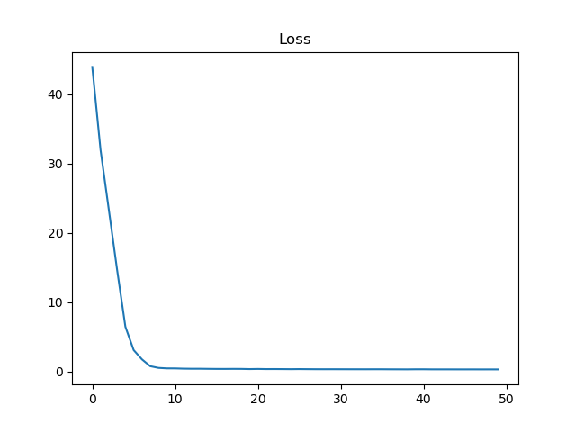
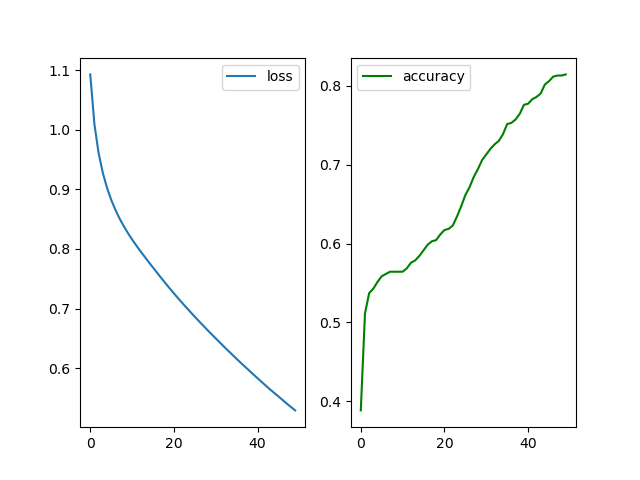
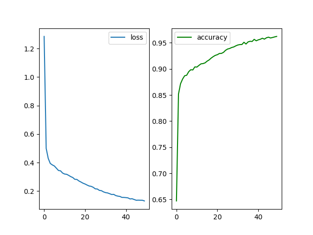
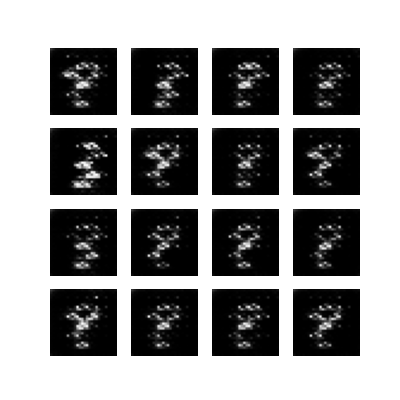
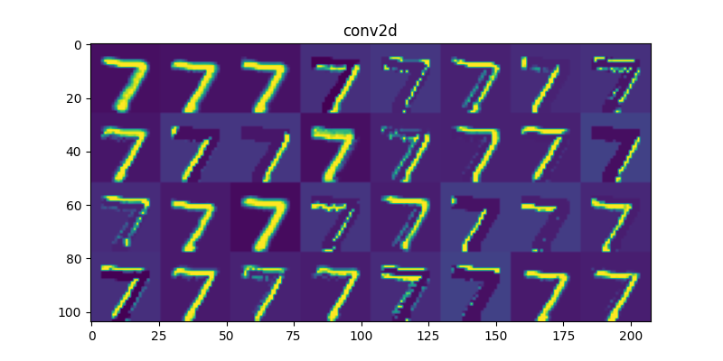
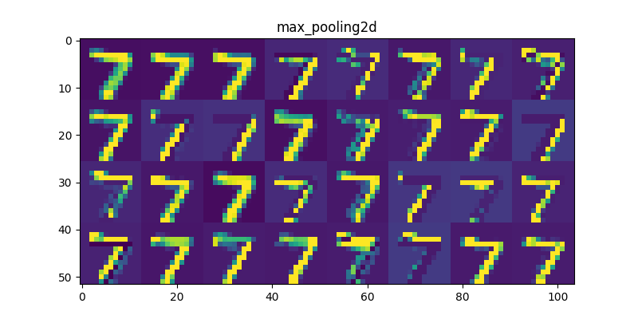
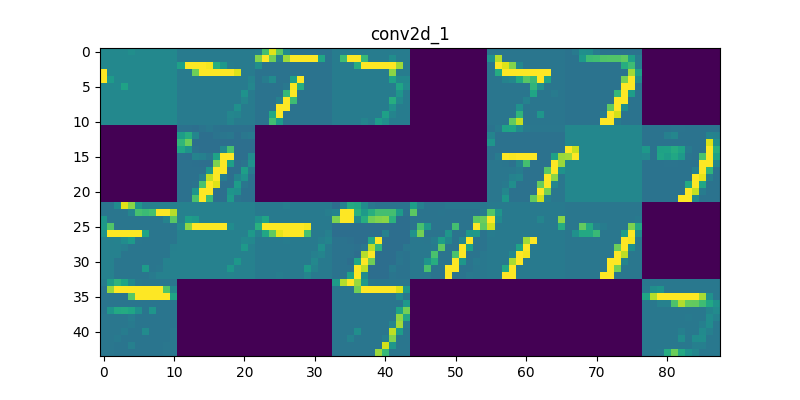
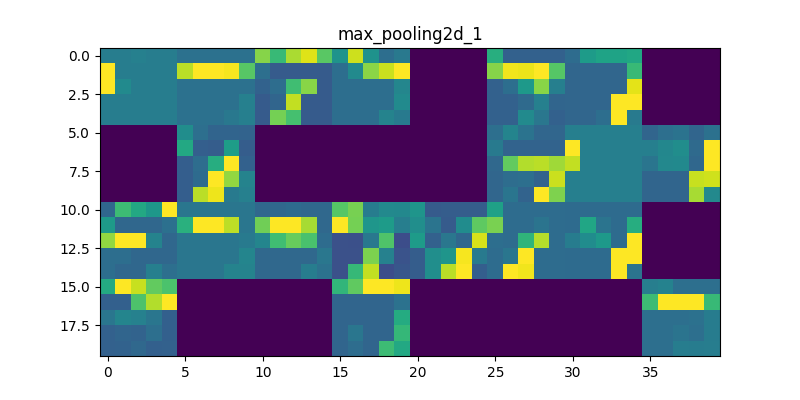

# tensorflow2

#### 1linear_regeression.py
 

 

#### linear_regeression2.py
 

#### regressionTf2.py
 

#### classifierTf2.py
 

#### cnnTf2.py
 

#### mnist_GAN.py
 

#### cnnVisual.py
|||
|---|---|
|||
|||

